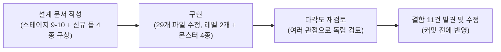

# mega1 프로젝트 AI 활용 보고서

## 1. 개요

저는 2D 플랫포머 게임 개발 프로젝트 `mega1`(웹 게임 제작에 쓰이는 도구 Phaser 4와 프로그래밍 언어 TypeScript로 만든 개념증명 단계의 게임)을 진행하면서 AI를 활용했습니다. 이 보고서는 그 과정을 정리한 것입니다.

- **작업 기간**: 2026-07-21 ~ 2026-08-08 (18일). 이 중 실제로 작업한 날은 7일이었습니다.
- **다루는 범위**: 어떤 AI 도구를 썼는지, 요청(프롬프트)을 어떤 방식으로 작성했는지, 실제로 어떤 작업에 AI를 활용했는지 세 가지입니다.
- **근거**: 아래 내용은 모두 이 저장소(코드와 문서가 버전별로 저장되는 공간, 여기서는 git 저장소)에 실제로 남아있는 커밋(작업 내용을 하나의 단위로 저장한 기록) 이력과 문서를 근거로 작성했습니다. 각 커밋을 식별하는 고유 코드(커밋 해시)를 함께 표기해, 필요하면 직접 확인할 수 있게 했습니다. `main`(여러 작업 줄기 중 실제로 합쳐져 남은 최종 이력) 기준으로 총 128건의 커밋 중 제가 작성한 116건의 67.2%에 AI가 공동작업자로 함께 기록되어 있습니다.

## 2. 사용한 AI 도구

**Claude Code** — 터미널에서 실행하는 AI 코딩 도구를 사용했습니다. 일반적인 대화형 AI 챗봇과 다른 점은, 이 도구가 실제로 저장소의 파일을 직접 읽고, 작업 계획을 세워 미리 확인받고, 코드를 작성·수정하고, 그 결과를 커밋까지 남긴다는 점입니다.

이 프로젝트의 커밋 중 제가 작성한 116건을 살펴보면, 78건(67.2%)에 AI가 공동작업자로 함께 기록되어 있습니다. 커밋 메시지에 남은 이름을 보면 사용한 모델은 다음과 같습니다.

| 모델 | 커밋 수 |
|---|---|
| Claude Opus 5 (초대형 문맥) | 50건 |
| Claude Sonnet 5 | 20건 |
| Claude Opus 4.8 (초대형 문맥) | 5건 |
| Claude (버전 미표기) | 3건 |
| Claude Opus 4.8 | 2건 |
| Claude Opus 5 | 1건 |

복잡한 설계나 대규모 검토에는 상대적으로 더 큰 모델(Opus 계열)을, 일상적인 구현 작업에는 가벼운 모델(Sonnet)을 섞어 썼습니다.

**Gemini** — 배경음악과 그림(이미지) 생성 기능을 사용했습니다. 배경음악은 Gemini의 음악 생성 기능으로 만들었고, 화면 그림과 캐릭터·배경 디자인은 Gemini의 이미지 생성 기능으로 초안을 만든 뒤 Claude Code로 다듬었습니다. 구체적인 과정은 4장(배경음악)과 5장(디자인)에서 설명합니다.

## 3. 개발

### 3.1 반복 설명 대신 규칙 파일에 쌓기

이 프로젝트에서 가장 눈에 띄는 방식은, 매번 대화할 때마다 같은 내용을 다시 설명하지 않았다는 것입니다. 대신 저장소 루트의 `CLAUDE.md` 파일에 "이 프로젝트에서 지켜야 할 규칙"을 계속 추가해 나갔고, 이후의 모든 요청에 이 규칙이 자동으로 적용되게 했습니다.

이 방식은 2026-07-31(커밋 `6eb57ba`, "docs(rules,skills): add platformer development guidelines")에 처음 도입했습니다. 그 전까지는 이 저장소에 Claude Code를 위한 설정이 전혀 없었습니다. 이때 작성한 설계 문서(`docs/superpowers/specs/2026-07-31-claude-context-management-design.md`)에서 `CLAUDE.md`(세션 시작 시 항상 읽는 공유 지침), `.claude/rules/`(특정 경로에만 적용되는 규칙), Skill(반복되는 다단계 작업 절차), git 커밋 훅(사람이 직접 커밋해도 항상 강제되는 검증)의 역할을 구분해서 정의했고, 이후 이 구조를 그대로 써 왔습니다.

> 참고: AI를 공동작업자로 표기하는 방식 자체는 이보다 앞선 프로젝트 3일차(2026-07-24)부터 이미 쓰고 있었습니다. 즉 "AI와 함께 작업한 것"과 "그 작업 규칙을 문서로 관리하기 시작한 것"은 서로 다른 시점의 일입니다.

예를 들어 이 프로젝트는 화면 크기와 게임 내부 좌표가 분리되어 있어 혼동하기 쉬운데, 이런 함정을 한 번 겪고 나면 그 내용을 규칙 파일에 적어두었습니다. 그러면 다음번에 같은 종류의 작업을 요청할 때 다시 설명할 필요가 없어집니다.

### 3.2 개발 중 AI가 기대와 다르게 동작한 부분을 규칙으로 반영하기

레티나 디스플레이에서 발사 장치가 화면마다 다른 높이로 떠 보이던 버그를 고친 뒤, 이 원인(화면 배율 처리 실수)을 사람이 다음번에 기억해 두는 방식에 맡기지 않고 "장애물이 서 있는 캐릭터를 실제로 맞힐 수 있는지 계산으로 검증하라"는 규칙과, 이를 자동으로 확인하는 검사를 만들어 두었습니다. 이후 스테이지 9-10에 몬스터 4종을 새로 추가하는 작업에서도 이 검사가 10개 스테이지 전체를 대상으로 자동으로 돌아, 같은 종류의 배치 실수가 다시 나오지 않았습니다.

배경음악을 다루다가 비슷한 방식으로 규칙을 만든 사례도 있는데, 이는 4장(배경음악)에서 설명합니다.

### 3.3 설계 → 계획 → 구현 → 검증 흐름으로 기능 개발

일상적인 개발 요청은 대략 다음과 같은 흐름으로 진행했습니다: 먼저 무엇을 만들지 설계 문서로 정리하고, 그 설계를 실행 가능한 작업 목록으로 쪼갠 뒤, 코드를 작성하고, 마지막에 결과를 다시 점검합니다. 아래는 이 흐름을 그대로 보여주는 실제 사례입니다(스테이지 9-10에 몬스터 4종을 새로 추가한 작업).

설계 문서를 작성한 지 약 75분 뒤에 구현이 완료됐고, 구현 내용은 설계 문서가 정한 방향(각 신규 몬스터를 기존 어떤 클래스를 참고해서 만들지 등)을 그대로 따랐습니다. 설계와 다르게 진행된 부분은 없었고, 구현 과정에서 생긴 사소한 버그(몬스터가 발판 중심에 스폰되는 문제 등) 2건만 나중에 고쳤습니다.

이 프로젝트에는 기능마다 날짜가 붙은 설계 문서 9개와 작업 목록 문서 6개가 남아 있어, 이것이 예외적인 경우가 아니라 프로젝트 전체의 기본 작업 방식이었음을 보여줍니다.

### 3.4 반복 작업을 절차 문서로 표준화

새로운 장애물이나 몬스터를 하나 추가하려면 7~8개 파일을 순서에 맞춰 고쳐야 하는데, 이런 반복 작업은 절차를 문서로 만들어 표준화했습니다. 이후에는 이 절차 문서를 참고하면 빠뜨리는 파일 없이 작업할 수 있습니다.

### 3.5 구현 완료 후 다각도 교차 검토로 결함 사전 발견

기능 구현을 마친 뒤 곧바로 커밋하지 않고, 서로 다른 관점에서 코드를 다시 검토하는 단계를 거쳤습니다. 스테이지 9-10 사례에서는 이 검토 과정에서 결함 11건을 배포 전에 미리 찾아 고쳤습니다.

### 3.6 이번 보고서 작성 요청도 같은 방식으로 진행

이 보고서 자체도 같은 방식으로 만들었습니다. 처음 요청은 "AI를 어떻게 활용했는지 보고서를 써야 하는데, 어떻게 작성할지 계획을 세워보자"는 것으로, 형식이나 세부 내용을 미리 정하지 않은 열린 요청이었습니다. 이 요청에 대해 먼저 저장소의 실제 커밋과 문서를 조사해 근거를 확보한 뒤, 보고서의 목적·형식·포함 범위를 먼저 확인받고 나서 계획을 확정하는 순서로 진행했습니다. "확실해 보이는 내용도 관례나 전제를 먼저 확인한다"는, 이 프로젝트에 쌓인 규칙이 이번 작업에도 그대로 적용된 것입니다.

## 4. 배경음악

배경음악은 **Gemini의 음악 생성 기능**으로 만들었습니다. 이 곡을 게임에 실제로 들여오는 작업은 Claude Code로 했습니다.

곡 파일(`public/audio/bgm.mp3`)을 추가한 것은 커밋 `e263e64`("feat(audio): add persistent looping background music")입니다. 이후 씬(화면)이 바뀌어도 음악이 끊기지 않도록 재생·정지 로직을 분리했고(`cccef13`), 화면마다 재생 범위를 지정했습니다(`ef5d54c`).

### 볼륨 관례를 확인하지 않고 진행했다가 되돌린 사례

"게임 플레이 중 배경음악을 없애자"는 요청은 그 자체로는 명확했습니다. 하지만 이 요청을 곧바로 끝까지 구현하고 나서야, 대부분의 플랫포머 게임은 배경음악을 계속 틀어두고 효과음보다 작게 낮춰 함께 들려준다는 것을 알게 됐고, 결국 구현했던 것을 되돌렸습니다(커밋 `e84d101`). 실제 원인을 따져보니 배경음악의 볼륨이 효과음보다 크게 설정되어 있었던 것뿐이었습니다 — "없애자"라는 해결책 형태의 요청을 그대로 실행하는 대신, 그 뒤에 있는 진짜 문제(볼륨 설정)를 먼저 확인했다면 되돌릴 필요 없이 훨씬 적은 작업으로 끝났을 것입니다. 이 경험 이후로는 요청이 명확해 보여도, 그 분야의 일반적인 방식과 다르게 진행하는 요청은 구현 전에 관례를 먼저 확인하고 알려주는 것을 규칙(`game-feel.md`)으로 삼았습니다.

### 효과음은 다른 방식으로 만들었습니다

배경음악과 달리 효과음(점프, 처치 등)은 Gemini가 아니라 Web Audio(브라우저에서 소리를 코드로 직접 만들어내는 기능)를 이용해 코드로 즉석 합성했습니다(`docs/superpowers/specs/2026-08-06-sfx-synthesis-design.md`). 외부 음원 파일이 필요 없다는 점이 배경음악과 다릅니다.

## 5. 디자인

화면 그림과 캐릭터·배경 디자인은 **Gemini의 이미지 생성 기능**으로 초안을 만든 뒤, 이 초안을 Claude Code에 주고 게임에 맞는 레트로 느낌으로 다듬어 달라고 요청했습니다.

### 타이틀·사망·클리어 화면

지금 게임을 하지 않는 세 화면(타이틀, 죽음, 전체 클리어)에 그림을 넣는 작업이었습니다(`docs/superpowers/specs/2026-08-08-title-death-win-screen-art-design.md`). Gemini로 만든 초안(시안 PNG)에는 아이패드 화면틀, "final score: 9999", "SWIPE" 안내 같은 목업 특유의 요소가 함께 들어 있었습니다. 이 초안을 자동 변환 도구로 그림 파일 그대로 옮기지 않고, 실제 게임 화면의 비율에 맞게 사각형·삼각형을 다시 나열해서 직접 그렸고, 이 게임에 없는 요소(점수판, 기기 테두리, 스와이프 조작 안내)는 반영하지 않았습니다.

### 고퍼 캐릭터와 세계관 배경

플레이어 캐릭터(고퍼)와 배경을 낮의 초원 → 노을 숲 → 지하 굴 세계관으로 다시 디자인하는 작업이었습니다(`docs/superpowers/specs/2026-08-05-gopher-nature-assets-design.md`). Gemini로 만든 여러 초안을 브레인스토밍 과정에서 직접 비교해 스타일을 확정한 뒤, 기존에 사각형 그리기 명령(`fillRect`)을 조합해 텍스처를 만드는 방식에 맞춰 픽셀 격자 스타일로 다시 그렸습니다.

두 경우 모두 같은 패턴입니다: 저는 Gemini로 만든 초안을 실제 게임의 제약(화면 비율, 그리는 방식, 필요 없는 요소 제거)에 맞게 Claude Code로 다시 그려서 반영했습니다.

## 6. 배운 점 및 향후 계획

### 잘 작동한 것: 실수를 "기억"이 아니라 "검증 가능한 규칙"으로 남기기

앞서 3.2절에서 설명한 레티나 디스플레이 버그 사례처럼, 한 번 겪은 실수를 사람의 기억력에 맡기지 않고 자동으로 확인하는 검사로 만들어 두면 이후 작업(스테이지 9-10 몬스터 추가 등)에서도 같은 실수가 반복되지 않았습니다.

### 주의가 필요했던 것: 요청이 명확해도 업계 관례와 다르면 먼저 확인해야 합니다

앞서 배경음악에서 설명한 사례처럼, 요청이 명확해 보여도 그 분야의 일반적인 방식과 다르게 진행하는 요청은 구현 전에 관례를 먼저 확인해야 한다는 것을 배웠습니다. "없애자"·"바꾸자" 같은 해결책 형태의 요청을 받으면, 그 뒤에 있는 진짜 원인을 먼저 확인하는 것이 되돌리는 낭비를 줄이는 방법이었습니다.

### 향후 계획

다음 프로젝트를 시작할 때는, 문제가 생긴 뒤에 규칙을 추가하는 지금까지의 방식 대신 이번 프로젝트에서 쌓인 규칙 중 프로젝트와 무관하게 적용할 수 있는 것 — 예를 들어 "해결책 형태의 요청은 그 뒤의 진짜 원인을 먼저 확인한다" — 을 처음부터 가져가 적용해 볼 예정입니다.
