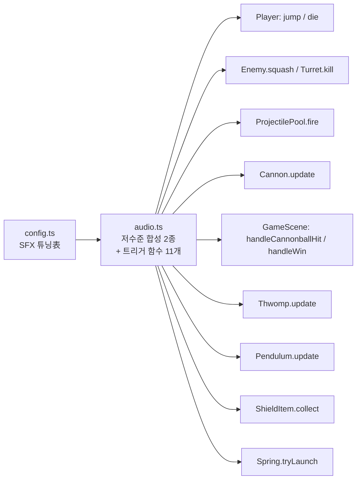

# 효과음(SFX) 설계 — Web Audio 즉석 합성

작성일: 2026-08-06

## 1. 개요 (무엇을 / 왜)

지금 게임에는 배경음악(`public/audio/bgm.mp3`, 완성된 mp3 파일 재생) 하나만 있고 효과음은 전혀 없다. 이번 작업은 게임플레이의 주요 순간 11곳에 짧은 효과음을 추가한다.

그림(텍스처)이 전부 `BootScene`에서 도형으로 절차적으로 생성되고 외부 이미지 파일이 없는 것과 같은 철학으로, 효과음도 **브라우저의 Web Audio API로 그때그때 합성**한다(외부 오디오 파일 없음). 배경음악만 예외적으로 완성된 파일을 쓰는 지금 구조는 그대로 둔다.

**게임 규칙·물리·난이도는 일절 변경하지 않는다.** 소리만 추가한다.

이 설계는 사용자와의 브레인스토밍 세션에서 4가지 질문(제작 방식·스나이퍼 매핑·누락 효과음·철퇴 재생 방식)에 대한 답을 받아 확정했다.

---

## 2. 효과음 목록 및 확정 사항

사용자가 제시한 8개 목록에, 코드 검토로 발견한 "소리가 비어있는 지점" 3개(스테이지 클리어, 방패 획득, 스프링 점프)를 추가해 총 11개로 확정했다.

| # | 효과음 | 비고 |
|---|---|---|
| 1 | 캐릭터 점프 | 원 목록 |
| 2 | 캐릭터가 적을 죽일 때 | 원 목록 — 일반 적(Enemy)과 포탑(Turret) 처치 공용 |
| 3 | 발사 소리 ("스나이퍼") | 원 목록 — **Turret(조준 포탑)과 Shooter(다트 발사기) 둘 다** 적용(사용자 확정) |
| 4 | 대포 소리 | 원 목록 |
| 5 | 방패로 막히는 소리 | 원 목록 |
| 6 | 바위가 떨어지는 소리 | 원 목록 — 코드상 `Thwomp`(압사기) |
| 7 | 캐릭터 죽을 때 소리 | 원 목록 |
| 8 | 철퇴가 움직이는 소리 | 원 목록 — 코드상 `Pendulum`(스파이크 볼). **호의 최저점(가장 빠른 지점)을 지날 때마다 짧게 재생**(사용자 확정, 계속 재생되는 루프 아님) |
| 9 | 스테이지 클리어 / 최종 승리 | 신규 추가(사용자 확정) — 중간 스테이지 클리어와 마지막 스테이지 승리 공통 |
| 10 | 방패 아이템 획득 | 신규 추가(사용자 확정) |
| 11 | 스프링(점프대) 튕김 | 신규 추가(사용자 확정) |

---

## 3. 기술 선택: AudioContext 출처 (확정)

Web Audio로 소리를 합성하려면 [`AudioContext`](https://developer.mozilla.org/ko/docs/Web/API/AudioContext)(브라우저 오디오 엔진의 진입점) 인스턴스가 필요하다. 두 가지 선택지를 검토했다.

| 선택지 | 설명 | 평가 |
|---|---|---|
| **A. Phaser의 기존 오디오 컨텍스트 재사용 (확정)** | 배경음악을 재생 중인 `scene.sound`가 `WebAudioSoundManager` 인스턴스이고, 여기에 이미 `context: AudioContext` 필드가 있다. 이를 그대로 가져다 쓴다. | 브라우저의 자동재생 정책(사용자 클릭/키 입력 전엔 소리 재생 금지)을 Phaser가 이미 처리해두었으므로 별도 처리가 필요 없다. 타이틀 화면에서 첫 입력 시 배경음악을 트는 시점(`MenuScene.ts`)이 이미 있어, 그 이후 효과음도 바로 재생 가능한 상태가 보장된다. |
| B. 완전히 별도의 `AudioContext`를 새로 만듦 | 배경음악 시스템과 무관한 독립 오디오 엔진. | 자동재생 정책을 효과음 쪽에서 또 처리해야 하고, 향후 "전체 음소거" 기능을 넣을 때 배경음악과 효과음을 따로 관리해야 한다. 이점이 없어 기각. |

### 검증한 사실

이 프로젝트에 설치된 정확한 버전(Phaser 4.2.1)의 타입 정의(`node_modules/phaser/types/phaser.d.ts:132595`)에서 직접 확인했다(추측 아님):

- `Phaser.Sound.WebAudioSoundManager`가 `context: AudioContext`와 `masterMuteNode: GainNode` 필드를 갖는다.
- `src/main.ts`에 `sound:` 설정이 없어 Phaser가 기본값(WebAudio 지원 시 `WebAudioSoundManager`)을 쓴다 — 이 프로젝트가 대상으로 하는 최신 브라우저에서는 항상 WebAudio 경로다.

합성한 소리는 `context.destination`이 아니라 **`masterMuteNode`**에 연결한다 — 이렇게 하면 나중에 Phaser의 전체 음소거 기능(`game.sound.mute`)을 켜면 배경음악과 효과음이 함께 꺼진다.

---

## 4. 아키텍처



### 4.1 저수준 합성 프리미티브 (`src/audio.ts`)

| 프리미티브 | 구현 | 소리 느낌 | 쓰이는 효과음 |
|---|---|---|---|
| `playTone(scene, opts, volume)` | `OscillatorNode`(sine) + `GainNode` 봉투(짧은 attack, exponential decay), 주파수를 `freqStart→freqEnd`로 스윕 | 삑/휭 하는 순음 | 점프, 적 처치, 발사, 방패 막기, 사망, 방패 획득, 스프링 점프 |
| `playNoiseBurst(scene, opts, volume)` | 화이트 노이즈를 채운 `AudioBufferSourceNode` + `BiquadFilterNode`(lowpass) + `GainNode` 봉투 | 퍽/쿵 하는 타격·마찰음 | 대포 발사, 바위 낙하, 철퇴 지나감 |
| `playWinJingle(scene, opts, volume)` | `playTone`을 `notes.length`번, `context.currentTime`을 `noteDurationMs`씩 밀어 순차 예약 | 짧은 상승 아르페지오(도-미-솔 등) | 스테이지 클리어/승리 |

각 프리미티브는 `getWebAudioContext(scene)`(내부 헬퍼, `scene.sound`가 `WebAudioSoundManager`인지 확인 후 `context`/`masterMuteNode`를 반환, 아니면 `undefined`)를 거친다. `undefined`면 아무 것도 하지 않고 조용히 반환한다.

### 4.2 트리거 함수 11개 (`src/audio.ts`)

`playJump`, `playEnemyKill`, `playFire`, `playCannonFire`, `playShieldBlock`, `playRockDrop`, `playDeath`, `playPendulumSwing`, `playWin`, `playShieldPickup`, `playSpringBounce` — 각각 `scene: Phaser.Scene` 하나만 받아 위 프리미티브 중 하나를 `config.ts`의 `SFX.<KEY>` 파라미터로 호출하는 한 줄짜리 함수.

### 4.3 `config.ts` 추가

```ts
/** SFX 합성 튜닝 — Web Audio, 외부 파일 없음(src/audio.ts). 정확한 수치는 구현 중 플레이테스트로 조정. */
export const SFX = {
  MASTER_VOLUME: 0.4,
  JUMP: { freqStart: 500, freqEnd: 900, durationMs: 90 },
  ENEMY_KILL: { freqStart: 600, freqEnd: 150, durationMs: 140 },
  FIRE: { freqStart: 900, freqEnd: 500, durationMs: 70 },
  CANNON: { durationMs: 180, filterFreq: 300 },
  SHIELD_BLOCK: { freqStart: 700, freqEnd: 700, durationMs: 90 },
  ROCK_DROP: { durationMs: 220, filterFreq: 150 },
  DEATH: { freqStart: 500, freqEnd: 80, durationMs: 400 },
  PENDULUM_SWING: { durationMs: 100, filterFreq: 800 },
  WIN: { notes: [523, 659, 784], noteDurationMs: 120 },
  SHIELD_PICKUP: { freqStart: 400, freqEnd: 1000, durationMs: 150 },
  SPRING_BOUNCE: { freqStart: 300, freqEnd: 1100, durationMs: 160 },
} as const;
```

이 문서는 값을 확정하지 않는다 — 구현 후 실제로 들어보며 이 테이블만 수정해 반복 튜닝한다(코드 재작성 불필요).

---

## 5. 트리거 지점 (파일 : 위치 확인됨)

| # | 효과음 | 파일 : 메서드 | 트리거 시점 | 비고 |
|---|---|---|---|---|
| 1 | 점프 | `Player.ts` : `jump()` | 점프가 실제로 발생하는 유일한 지점(코요테 타임·점프 버퍼링 경로 포함) | |
| 2 | 적 처치 | `Enemy.ts` : `squash()`, `Turret.ts` : `kill()` | 밟아서 처치했을 때 | 두 곳 모두 `playEnemyKill()` 재사용 |
| 3 | 발사 | `ProjectilePool.ts` : `fire()` | 풀이 고갈되지 않아 실제로 발사됐을 때 | `Turret.fireAt()`과 `Shooter.update()`가 공용으로 호출하는 단일 지점 — **여기 한 곳만 수정하면 둘 다 커버**됨. 현재 `ProjectilePool`이 `scene`을 필드로 저장하지 않으므로 `private readonly scene: Phaser.Scene` 필드를 추가해야 함 |
| 4 | 대포 발사 | `Cannon.ts` : `update()` | `new Cannonball(...)` 생성 시점 | |
| 5 | 방패로 막기 | `GameScene.ts` : `handleCannonballHit()` | `player.shieldCharges > 0`이라 흡수될 때 | 충전이 없어 관통사망하는 경우는 재생 안 함(7번 사망 소리만 재생) |
| 6 | 바위 낙하 | `Thwomp.ts` : `update()`의 `dropping` 모드가 바닥에 닿는 순간 | 기존 `shakeCamera(...)` 호출과 같은 지점 | |
| 7 | 캐릭터 사망 | `Player.ts` : `die()` | 사망 확정 시 | 기존 `isDead` 중복 방지 가드를 그대로 재사용(추가 가드 불필요) |
| 8 | 철퇴 이동 | `Pendulum.ts` : `update()` | 호의 최저점을 지날 때마다(아래 5.1) | |
| 9 | 스테이지 클리어/승리 | `GameScene.ts` : `handleWin()` | 깃발 도달 확정 시 | 중간 스테이지·최종 스테이지 공통(다음 씬이 `GameScene` 재시작이든 `WinScene`이든 동일하게 한 번 재생) |
| 10 | 방패 획득 | `ShieldItem.ts` : `collect()` | 픽업 습득 시 | |
| 11 | 스프링 튕김 | `Spring.ts` : `tryLaunch()` | 위에서 밟아 발사될 때(`body.touching.up` 가드 재사용) | |

### 5.1 철퇴 "최저점 통과" 판정 — 신규 순수함수

프로젝트 관례(`motion.ts`처럼 시간 기반 로직은 Phaser 비의존 순수함수 + `motion.test.ts` 단위테스트)를 따른다.

`Pendulum`의 각도는 이미 `pendulumAngleRad()`가 `amplitudeRad * sin(TAU * (elapsedMs/periodMs + phase01))`로 계산한다. "최저점을 지났는지"는 `elapsedMs/periodMs + phase01`이 0.5의 배수(반주기 경계)를 넘었는지로 판정할 수 있다.

`src/levels/motion.ts`에 추가:

```ts
/** [prevElapsedMs, elapsedMs) 사이에 진자가 호의 최저점(반주기 경계)을 지났는지. */
export function pendulumCrossedBottom(
  prevElapsedMs: number,
  elapsedMs: number,
  periodMs: number,
  phase01 = 0,
): boolean {
  if (periodMs <= 0) return false;
  const prevHalf = Math.floor(2 * (prevElapsedMs / periodMs + phase01));
  const half = Math.floor(2 * (elapsedMs / periodMs + phase01));
  return half !== prevHalf;
}
```

`Pendulum` 클래스가 `private lastElapsedMs = 0` 필드를 새로 두고, `update(elapsedMs)` 시작부에서 `pendulumCrossedBottom(this.lastElapsedMs, elapsedMs, ...)`를 확인한 뒤 `this.lastElapsedMs = elapsedMs`로 갱신한다. 생성 직후 첫 프레임은 `lastElapsedMs`가 `0`이므로, `elapsedMs`도 `0`에서 시작하는 한 오탐은 없다(다른 시간 기반 오브젝트와 동일한 가정).

---

## 6. 실패 처리

기존 `startBgmOnce()`가 세운 패턴(로드/재생 실패해도 `console.warn`만 남기고 게임 진행은 막지 않음, 최근 커밋 `fb3f6bf`)을 그대로 따른다. `getWebAudioContext()`가 `undefined`를 반환하면(이론상 `WebAudioSoundManager`가 아닌 폴백 상황) 각 재생 함수는 조용히 아무 것도 하지 않는다. 합성 자체는 로컬 계산이라 별도의 try/catch가 필요한 외부 실패 지점은 없다.

---

## 7. 테스트 전략

- **`pendulumCrossedBottom`** (신규 순수함수): `motion.test.ts`에 단위테스트 추가.
  - `[Happy]` 한 프레임 사이에 반주기 경계를 넘는 경우 → `true`
  - `[Boundary]` 경계 값 정확히 위(`prevElapsedMs`와 `elapsedMs`가 같은 반주기 구간에 머무는 경우) → `false`; `periodMs <= 0` → `false`
  - `[Error]` 해당 없음 — 입력이 항상 유한한 숫자이고 예외를 던지는 외부 의존성이 없는 순수 계산이라 예외 케이스가 존재하지 않음(사유 명시).
- **`audio.ts`의 합성 함수 11개 + 프리미티브 2종**: 브라우저 `AudioContext`가 필요해 Vitest(jsdom 미탑재)로 단위테스트할 수 없다 — 기존 `shakeCamera`나 `BootScene`의 텍스처 생성 코드와 동일하게 **수동 플레이테스트**로 검증한다(`npm run dev`로 11개 지점을 각각 발생시켜 소리가 나는지 확인).
- 11개 트리거 호출 지점 자체는 이미 가드된 상태 변경 메서드에 한 줄을 추가하는 것이므로 별도 단위테스트 대상이 아니다.

---

## 8. 범위 외 (이번에 하지 않음)

- 전체 음소거/볼륨 조절 UI — 없음(추후 필요 시 별도 스펙).
- 효과음 파일 교체(완성된 오디오 자산으로 바꾸는 것) — 이번엔 코드 합성만. 나중에 원하면 `audio.ts`의 트리거 함수 내부만 바꿔 파일 재생으로 교체 가능(호출부는 무수정).
- 메뉴/UI 클릭 소리, 트랩플로어·크럼블링 플랫폼 등 목록에 없던 추가 하자드 소리 — 사용자가 명시적으로 고른 11개만 진행.
